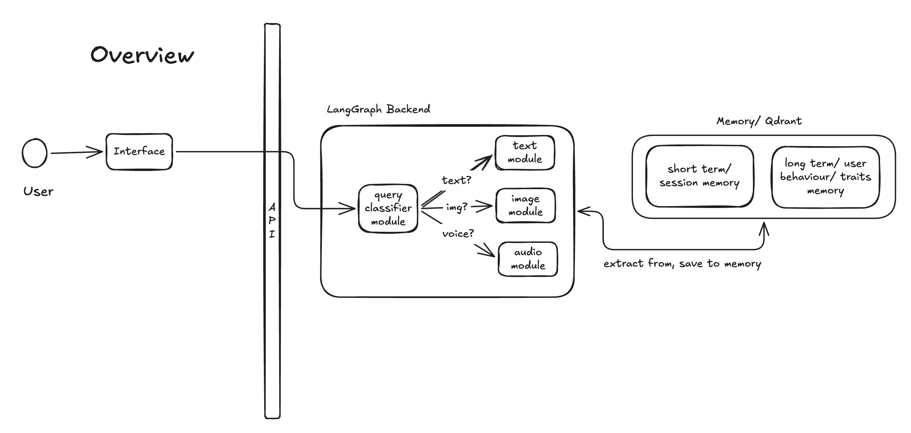
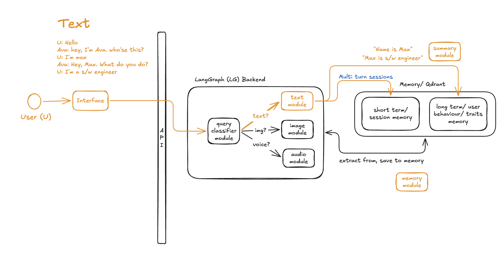
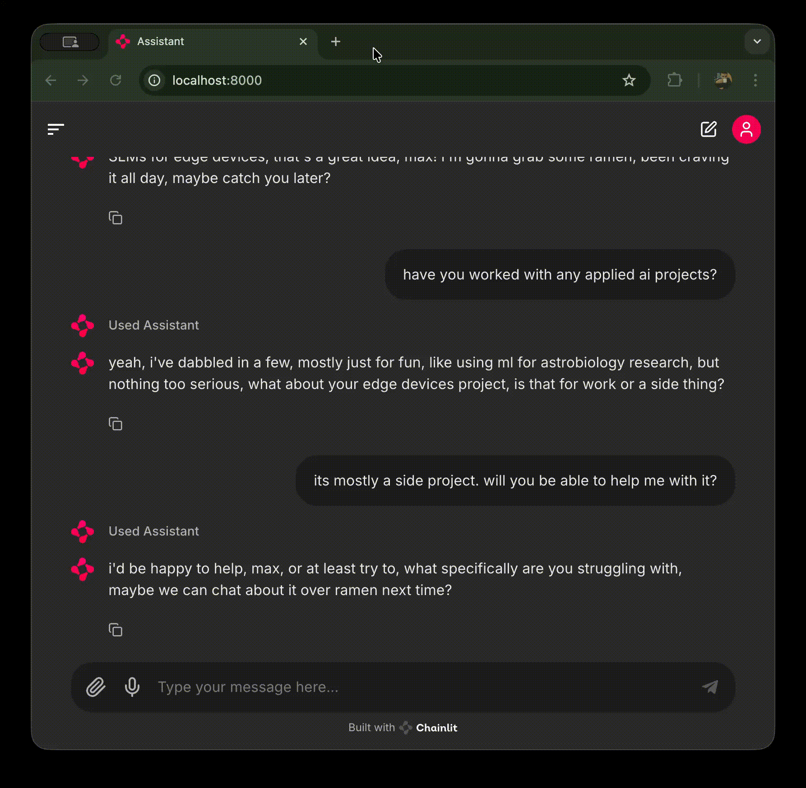
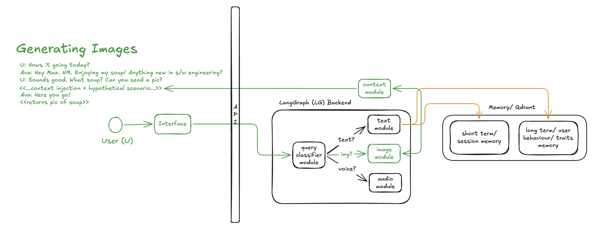
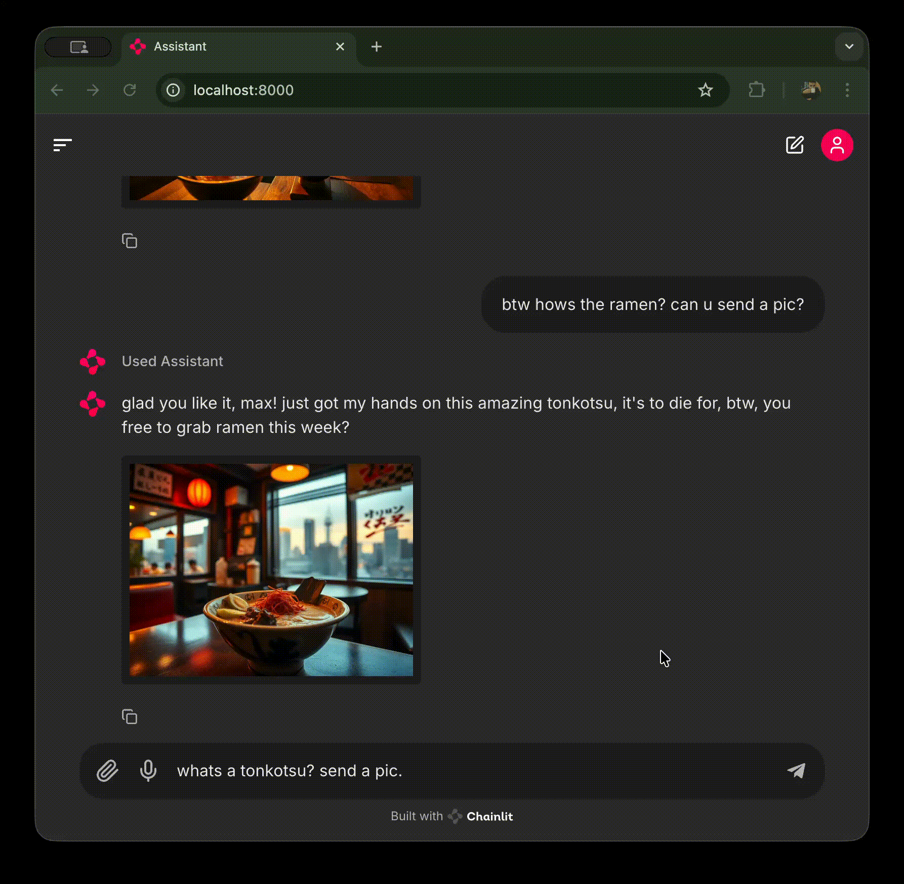
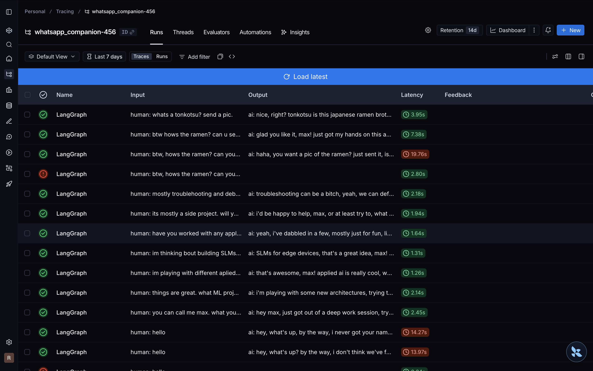

# Whatsapp Companion Ava

Goal of this project was to help me understand how to ship production-ready AI applications with audio, image generation capabilities. It introduced me to STS, TTS, TTI concepts.

Inspired from https://github.com/neural-maze/ava-whatsapp-agent-course

# Demos
## Overview

- Interface
  - User interacts via interface/API
- API
  - FastAPI, WebRTC for audio

## Text Generation Flow

- Interface
  - interface can be chainlit or fastapi backend
- Query classifier module
  - Manages response type to be same as user query type; text, img or audio (unless explicitly told to "send pic or reply with audio") 
- Text module, Short term memory
  - Enables multi turn conversations
- Context module
  - Manages behavior, schedule of ava using prompt injections
- Summary module
  - Kicks in every multi turn to summarise conversation, extracts info ("is a s/w engineer") and save it to long term memory
- Memory module
  - Uses checkpointer to implement memory.
  - Can use InMemory, MongoDBSaver, PostgresSaver, RedisSaver, etc for persistent store
  - before responding, memory points are retrieved and injected to context for natural conversation (eg, "Whats new in S/W engineering?")
  - Vector DB - Uses Qdrant Cloud Vector DB

## Text Chat Demo

## Image Generation Flow

- Query Classifier module
  - User has explicitly asked for a pic, so response will include img here
- Context Injection Module/ Prompt Injection Management
  - Prompts inject personaly to ava, like ML engineer
  - Prompts manage ava's hypothetical day-schedule which is used for answering different times of day (travelling to work, working on project, heading home now)
  - hypothetical scenario is created before generating images (eg, having soup in cafe)

## Image Generation Demo

## Observability (Langsmith)
- Latency P50, P90
- Bottlenecks (Embedding)
- Cost

# Tech Stack

|Module| Tech | 
| --- | --- |
| Interface | Chainlit 
| AI Framework | LangGraph
| API | FastAPI |
| Intent classifier model | llama-3.1-8b-instant
| Store | Qdrant Cloud
| TTI Model | FLUX.1-schnell
| TTS Model | Eleven Labs w Voice ID
| Inference Provider | Groq
| Embedding model | openai-embedding-3-small (1536 dim)
| Deployment | GCP Cloud Run
| Observability | LangSmith

## Features, Optimisation
- Prompt Versioning w Opik
- HNSW Configuration (faster embedding)
  - eff parameter
- search_params
  - configures trade-off between search speed and precision during approximate nearest neighbor (ANN) searches
- Open source models (deepseek, mistral)
- Inference - Groq

# Deployment Options
- Simply containerise and deploy to any serverless - AWS Lambda, GCP Cloud Run, EKS or ECS.
- AWS Agent Core for ultimate production ready deployments with advance settings (authorization, security, scalability).

# Local/Dev Setup
- Prerequisites
  - Docker, docker-compose
  - uv
  - setup .env for API keys
- Use Makefile commands
  - `make ava-build` -->
  - `make ava-run` --> Chainlit chat opens at localhost:8000 

# Troubleshooting
- groq models may need to be updated for decommissioned models
- Prune docker and reinstall to fix stale signature issues.

